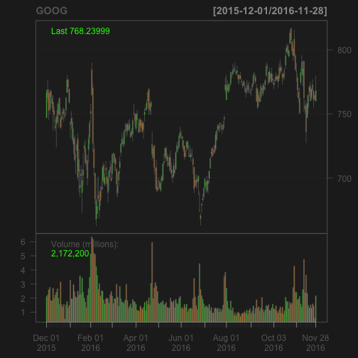

Stock Quotes
========================================================
author: Emmet Murphy
date: November 27, 2016
autosize: true

https://emmet.shinyapps.io/stock_quotes/  
https://github.com/emurphy/shiny-stock-quotes

How to use
========================================================

https://emmet.shinyapps.io/stock_quotes/

Is it not self-explanatory and self-documenting?

Just in case, the steps are:
- Enter ticker symbol
- Click 'Get quote' and wait a few seconds
- See the latest price

Enter ticker symbol
========================================================

You can look up more ticker symbols here: http://finance.yahoo.com/lookup

Our favorites:
- BRKA for Berkshire Hathaway
- GOOG for Google
- TM for Toyota 

To enter multiple symbols, separate with a semi-colon

Quantmod lookups
========================================================
After submit, Quantmod gets the latest price  


```r
library(quantmod)
price <- function(symbol) getQuote(symbol)$Last
price('GOOG')
```

```
[1] 768.24
```

Full source code available at  
https://github.com/emurphy/shiny-stock-quotes

Planned feature
========================================================

Chart the price using sample code from https://gist.github.com/wch/4026749


```r
chartSeries(symbol_data, name='GOOG', subset='last 12 months')
```


